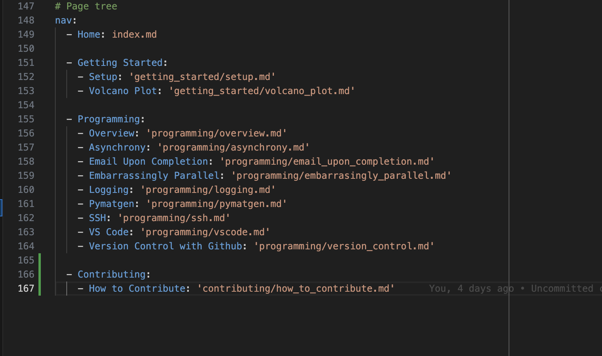

Thank you for your interest in contributing to this documentation page! Here we'll walk through the necessary steps needed to contribute to the project.

## Clone the Repository

First, you'll want to clone the repository.

=== "SSH"

    ``` bash
    git clone git@github.com:nrdavid/whsun-docs.git
    ```

=== "HTTPS"

    ``` bash
    git clone https://github.com/nrdavid/whsun-docs.git
    ```

## Creating a new branch

Once you've cloned the repository, you can create a new branch with the topic you'd like to contribute with. For example, I'm adding a section on "How to contribute" so maybe I'd name my branch "contributing". This will create the new branch and enter it.

``` bash
git checkout -b contributing
```

## Making your changes

To add your section to the navigation bar, go to `mkdocs.yml` and add your section to the `nav` tree. You will also need to create a new markdown file (and folder if necessary).

**NO OTHER PORTION OF `mkdocs.yml` SHOULD BE MODIFIED**

You should also follow the conventions laid out in other sections like adding a `imgs` folder for you images.

<figure markdown="span">
    
    <figcaption>Adding your section to the `nav` tree.</figcaption>
</figure>

## Commit, Push, and PR

Once your changes are done, add, commit, fetch, rebase, and push them to the remote. Please make your messages meaningful.

Fetch the latest changes and rebase your changes to `main` to create an easier pull request.

``` bash
git fetch
```

``` bash
git rebase main <BRANCH_NAME>
```

If this is your first time adding this branch, you will need to set its upstream like so:

``` bash
git push --set-upstream origin <BRANCH_NAME>
```

After that, go to the repository online and create a pull request to main. @nrdavid will then review the request!

## Post PR approval

After your PR has been approved and merged into `main`, you should clean up your branch if you're no longer using it.

``` bash
git push -d origin <BRANCH_NAME>
```

``` bash
git branch -d <BRANCH_NAME>
```

That's it. Thank you!