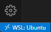

## Overview

This tutorial will get you started with basic python programming using conda for environment management and Visual Studio Code as an integrated development environment (IDE).

## Windows Subsystem for Linux

If you're developing on Windows, it is recommended that you first install Windows Subsystem for Linux (WSL) on your machine. WSL is a virtualization software that lets developers install a Linux distribution (such as Ubuntu, OpenSUSE, Kali, Debian, Arch Linux, etc) and use Linux applications, utilities, and Bash command-line tools directly on Windows, unmodified, without the overhead of a traditional virtual machine or dualboot setup.

To setup, follow the instructions below:

1. Open PowerShell in **administrator** mode by right-clicking and selection "Run as administrator".
2. Install wsl with the default Ubuntu distribution and follow the directions on screen. It may ask you to set a username and password for your unix subsystem account.
``` powershell
wsl --install
```
3. Now you should be able to invoke WSL from the shell simply by typing
``` powershell
wsl
```

To exit wsl simply type `exit`.

## Installing Conda

[Conda](https://conda.io/projects/conda/en/latest/index.html) is an environment manager frequently used with Python. There are a few different installers, but we'll specifically be looking at [Miniconda](https://docs.anaconda.com/miniconda/), a free minimal installer for conda.

Navigate to your home directory `cd ~` and copy and paste the following.

``` bash
mkdir -p ~/miniconda3
wget https://repo.anaconda.com/miniconda/Miniconda3-latest-Linux-x86_64.sh -O ~/miniconda3/miniconda.sh
bash ~/miniconda3/miniconda.sh -b -u -p ~/miniconda3
rm ~/miniconda3/miniconda.sh
```

To initialize conda run:

``` bash
~/miniconda3/bin/conda init bash
~/miniconda3/bin/conda init zsh
```

You may need to restart your shell in order for the changes to take effect.

???+ tip "Tip - Mamba Solver"

    Solving environments with the default solver in conda can be slow. It's suggested that you chnage the solver to **mamba** which acts as a drop in replacement. To use the new solver, update conda in your base environment:
    ``` bash
    conda update -n base conda
    ```
    To install and set the new solver, run the following commands:
    ``` bash
    conda install -n base conda-libmamba-solver
    conda config --set solver libmamba
    ```
    Read more about it [here](https://www.anaconda.com/blog/conda-is-fast-now). Now solving environments will be faster without any changes.

## Using Visual Studio Code

Download and install [Visual Studio Code](https://code.visualstudio.com/"). Follow the installation instructions for your OS. VS Code is a lightweight IDE used for a variety of langauges. Once installed open VS Code and navigate to the "Extensions" tab (1). Search the marketplace for the "Python" extension and install. With this extension VS Code will be able to recognize Python, giving you meaningful feedback from the IDE when writing your code.
{ .annotate }

1.  VS Code extensions are what makes VS Code more than just a text editor. Take some time to explore the extensions
    marketplace to increase your productivity as a programmer.

Now locate the "New File" option in VS Code to create a new file. Then save it as a `.py` file to tell VS Code that this file is a python script. Now in VS Code open a "New Terminal" using the toolbar. From here you should have opened a new interactive shell within VS Code. Now active your conda environment and type `python filename.py` to run your script (make sure your in the same directory as your saved python file).

<figure markdown="span">
  
  <figcaption>Getting Python setup in VS Code.</figcaption>
</figure>

At this point it's also a good idea to open the Command Palette to tell VS Code (and Pylance) which Python interpreter to point to. This will allow VS Code to properly identify which packages you have installed and which you do not. Use <span style="color:blue">&#8679;&#8984;P</span> (Mac) or <span style="color:blue">`Ctrl+Shift+P`</span> (Windows). Then type `Python: Select Interpreter` and select the option. From here you should see all your available global environments. Choose the one you've setup and are using.

???+ warning "Warning - WSL Users"

    { align=left }
    Since WSL acts like a VM, you will first need to "Open a Remote Window" to WSL inside VS Code in order to access your environment. In the bottom left of VS Code there are two staggered chevrons facing towards each other inside of a blue ribbon. Click this and a popup will appear. Select "Connect to WSL" to start the connection.

???+ note annotate "Note - Settings Sync"

    Settings Sync allows VS Code to share your configurations like extensions, shortcuts, etc. across devices when signed in. You can follow the instructions [here](https://code.visualstudio.com/docs/editor/settings-sync#_turning-on-settings-sync) to set up Settings Sync. It is recommended that you sign in with your GitHub credentials (1).

    >   VS Code does not synchronize your extensions to or from a remote window, such as when you're connected to SSH, a development container (devcontainer), or WSL.

1.  If you do not have a GitHub you can create one [here](https://github.com/). It is also a good idea to join [GitHub Education](https://github.com/education/students) which will give you access to premium features such as [GitHub Copilot](https://github.com/features/copilot) :octicons-copilot-16:.
