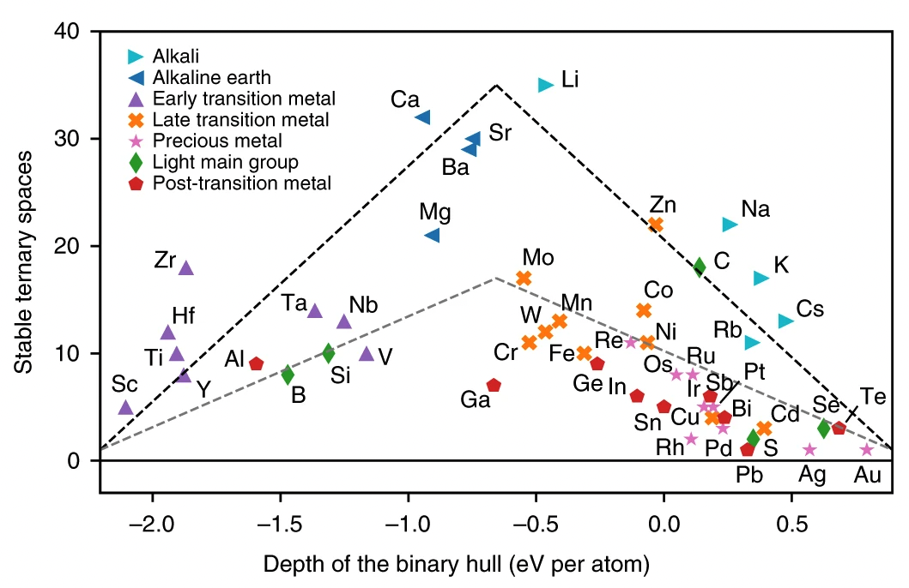

## Overview

Welcome! This guide will teach you how to get started with Python and <a href="https://materialsproject.org/api">The Materials Project API</a>. The Materials Project is a powerful database providing access to over 140,000 unique materials. These materials along with a plethora of their properties were calculated *ab-initio*, or from first principles. Many of these calculations are driven by high-throughput density-functional theory (DFT). Given only a materials crystal structure, DFT can calculate a variety of different materials properties. By the end of this guide you'll have learned to (1) run Python scripts, (2) connect to the Materials Project API, and (3) plot in <a href="https://matplotlib.org/">matplotlib</a>. This will be done by creating what we like to call "The Volcano Plot" from the paper, <a href="https://www.nature.com/articles/s41563-019-0396-2">"A map of the inorganic ternary metal nitrides"</a>, by Wenhao Sun et al.

<figure markdown="span">
    
    <figcaption>The Volcano plot.</figcaption>
</figure>

## Connecting to the Materials Project API

The Materials Project allows anyone to have direct access to current, most up-to-date information for the Materials Project database through their application programming interface (API).

### Getting a Key

Go to the <a href="https://materialsproject.org/api"> Materials Project API</a> and create an account to acquire a key. This key is your API access to their database. Keep track of this.

### Connecting to the API

Since you've created a new conda environment, you'll need to install the required packages in order to connect to the Materials Project API. This can be done via `conda install <package name>`. In your environment type:

```conda install mp-api```

into your terminal. After doing open a new python file and run the following code:

```py
# Testing connectivity to API by grabbing data for "mp-149"
from mp_api import MPRester
with MPRester(api_key=YOUR_KEY) as mpr:
    doc = mpr.summary.get_data_by_id("mp-149")
```
If the code above executes with no errors, you're all set!

## Completing the Onboarding Assignment

Now you have all the necessary ground work to produce the volcano plot! The next steps are entirely up to you, but I would recommend following the ordered list below.

1.  Read <a href="https://www.nature.com/articles/s41563-019-0396-2">"A map of the inorganic ternary metal nitrides"</a>, by Wenhao Sun et al.
2.  Read the <a href="https://docs.materialsproject.org/">Materials Project API Docs</a> and play around with the API functionality.
3.  Acquire the data needed to create the volcano plot.
4.  Familiarize yourself with <a href="https://matplotlib.org/">matplotlib</a>, then make the plot! Note: The plot may look slightly different from API changes over the years.

Lastly, good luck!