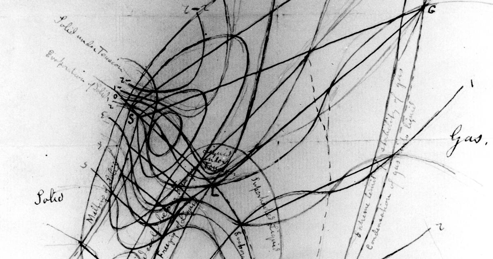

# Welcome to the Sun Group Handbook

This handbook serves as documentation for commonly used computational resources for the Sun Research Group at the University of Michigan - Ann Arbor.

<figure markdown="span">
  
   *Diagram of thermodynamic surface from Maxwell's book Theory of Heat.*
</figure>

> Classical thermodynamics is the only physical theory of universal content which I am convinced will never be overthrown. - Albert Einstein