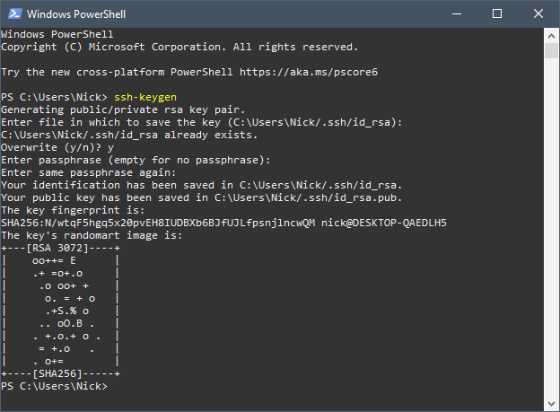
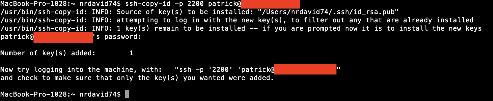

There are a few different ways to connect to a linux server. The most common way is to use a password. However, this is not the most secure way to connect to a server. A more secure way is to use SSH key authentication. This guide will demonstrate how to configure SSH key authentication on a linux server.

## What is SSH key authentication?
SSH key authentication is a way to connect to a linux server without using a password. Password authentication can be brute-forced by powerful computers. In SSH key authentication we instead use a public and private key pair. These key pairs are cryptographically secure keys that can be used to authenticate a client to an SSH server. The private key is held by the client and should never be shared. Compromise of the private key will result in a breach. The public key is held by the server and can be shared with anyone. The public key is used to verify the client's identity. The public key is also used to encrypt messages that can only be decrypted by the private key. This is called *asymmetric encryption*. They public key is added to a special file within the user account that you'll be logging into called `~/.ssh/authorized_keys`. When a client attempts to authenticate using the SSH key, the server will test the client by encrypting a message with the public key. If the client can decrypt the message with the private key, the client is authenticated and a session is spawned.

???+ warning "Warning - UMich Users"
    
    If your host machine lies within the Universities network, you will likely need to be connected inside of that network or be able to tunnel in using a VPN prior to connection. 

## Creating the SSH key pair

On your local computer, generate the SSH key pair using the following command:

```bash
ssh-keygen
```
By default, the keys will be stored in the `~/.ssh` directory. You will be prompted to enter a passphrase. This is an optional security measure. If you choose to use a passphrase, you will be prompted to enter it every time you use the key pair. If you do not want to use a passphrase, just press enter. The public key will be stored in `~/.ssh/id_rsa.pub` and the private key will be stored in `~/.ssh/id_rsa`. If you already have a key pair, you can choose to overwrite it. **Warning** You will not be able to authenticate using the previous key pair if you overwrite it. If done successfully, you should see something like this:

<figure markdown="span">
  
  <figcaption>Successful public and private key pair generation.</figcaption>
</figure>

## Copying the SSH public key to your server - ssh-copy-id

Now that you have generated the SSH key pair, you need to copy the public key to your server. You can do this using the `ssh-copy-id` command. The syntax is as follows:

```bash
ssh-copy-id -p port_number username@remote_host
```
where you would replace username, remote_host, and port_number with your own values. You will be prompted to enter your password. If done successfully, you should see something like this:

<figure markdown="span">
  
  <figcaption>Successful ssh-copy-id to server.</figcaption>
</figure>

## Copying the SSH public key to your server - SSH

If you do not have the `ssh-copy-id` command, you can copy the public key to your server using the `ssh` command. The syntax is as follows:

```bash
cat ~/.ssh/id_rsa.pub | ssh username@remote_host -p port_number "mkdir -p ~/.ssh && cat >> ~/.ssh/authorized_keys"
```
where you would replace username, remote_host, and port_number with your own values. You will be prompted to enter your password.

## Authenticating to your server using SSH keys

Simply type the following command:

```bash
ssh username@remote_host -p port_number
```
where you would replace username, remote_host, and port_number with your own values. If you did not use a passphrase, you will be logged in immediately. If you did use a passphrase, you will be prompted to enter it.

## Disabling password authentication

Now that we've successfully authenticated using SSH keys, we can disable password authentication. This will prevent anyone from logging in using a password. To do this, we need to edit the `/etc/ssh/sshd_config` file on your server. Open the file using your favorite text editor. I'll be using nano:

```bash
sudo nano /etc/ssh/sshd_config
```
Search for the directive called PasswordAuthentication. Uncomment it and set it to no:

```bash
PasswordAuthentication no
```
Save the file and exit. Now restart the SSH service:

```bash
sudo service ssh restart
```

Now if you attempt to login from a machine that does not have the SSH key pair, you will be denied access and not allowed to enter a password.

## Conclusion
In this tutorial we explored how to configure SSH key authentication on a linux server. We also explored how to disable password authentication. This is a more secure way to connect to a linux server. There are many other security measures you can take to protect your linux server. This guide is based off the following [DigitalOcean tutorial](https://www.digitalocean.com/community/tutorials/how-to-configure-ssh-key-based-authentication-on-a-linux-server). If you would like to read more about how to protect your linux server, you can read the following [DigitalOcean tutorial](https://www.digitalocean.com/community/tutorials/an-introduction-to-securing-your-linux-vps).