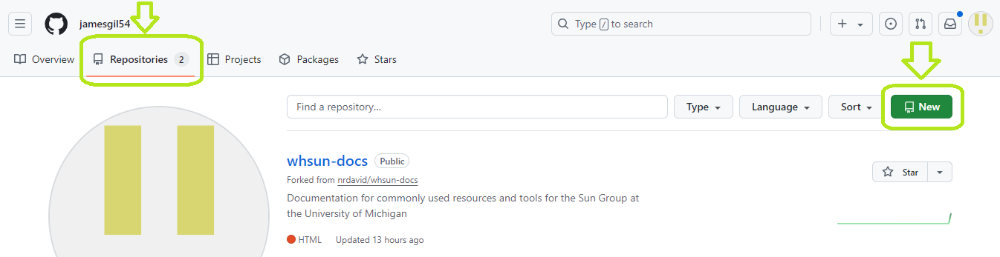
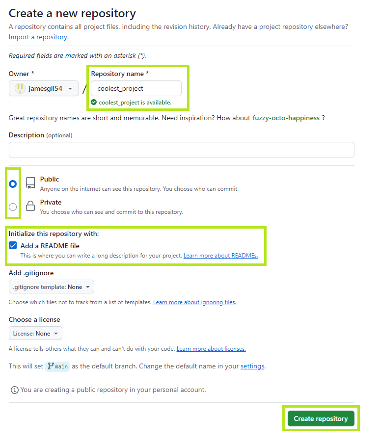
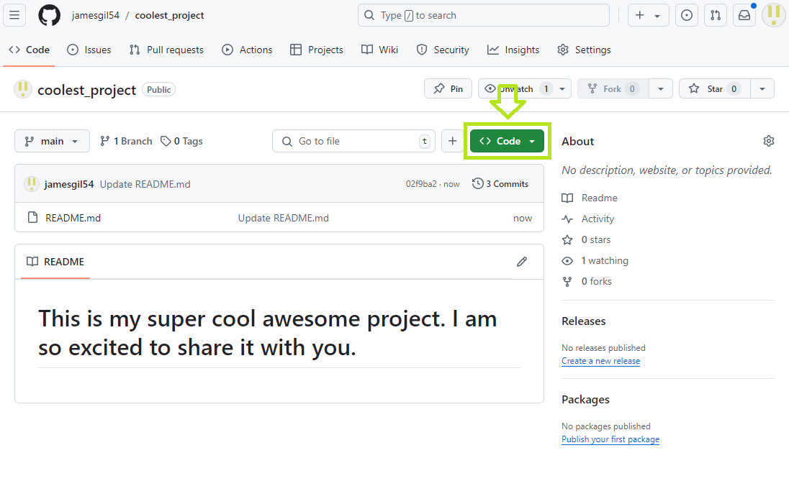
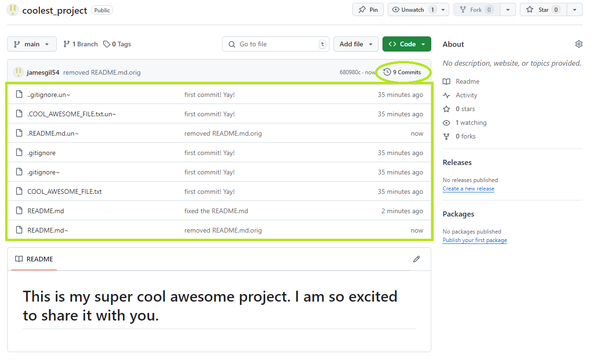
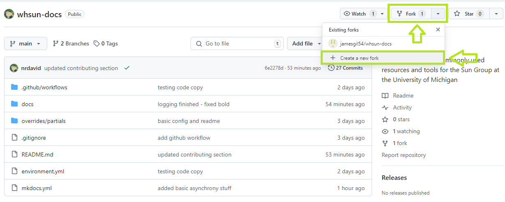
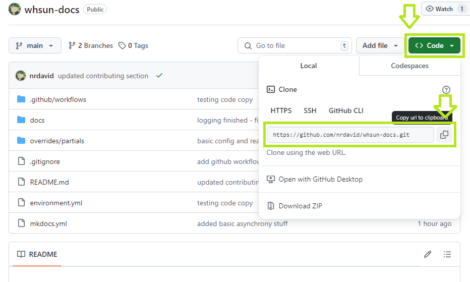

#Version Control with Github

Version control refers to the practice of keeping saved versions of your code separate from the version you are actively editing. This way, if you accidentally delete the file you're working on, or if you royally mess something up and can't figure out how to fix it, you can easily recover past versions of your program. Github is a terrific platform for practicing version control, plus its free and relatively user-friendly. Github also provides a convenient and navigable platform for you to make your code publically available, acting as a living breathing account of your programming repertoire. Adding your github link to your resume/CV is a great practice to easily share your programming accomplishments. 


## Pre-requisites: install git on your machine and make a Github account

First, make sure you have git installed on your machine. If not, follow the instructions [here](https://git-scm.com/book/en/v2/Getting-Started-Installing-Git). Also, if you don't have a GitHub account, start one [here](https://github.com/). Select **Join Github Education** to take advantage of helpful features like Copilot. 

## A. If you have an existing directory that you'd like to store on a Github repository

If you have a well-established project which you would like to turn into a Github repository, navigate to the directory of your project and execute the following

### 1. Create a local repository

navigate to the direcotry of your project

``` bash
    cd /Users/whsun/Documents/my/super/cool/project
```

make a .gitignore file. This is a text file which specifies which files you dont want backed up to your Github repository. This includes any data caches, folder/environment attributes, or whatever else you don't want copied to your project's Github page. 

```bash
vim .gitignore
```
``` title=".gitignore" 
site/
.DS_Store
.cache
```
OR
``` bash
wget https://raw.githubusercontent.com/nrdavid/whsun-docs/refs/heads/main/.gitignore -O .gitignore
```
Initialize a Github repository in your current project folder:
``` bash
$ git init 

Initialized empty Git repository in /Users/whsun/Documents/my/super/cool/project
```

``` bash
$ git status

On branch main

Untracked files:

	.gitignore
    ...

nothing added to commit but untracked files present (use "git add" to track)
```

Add any files in the directory to your new repo:
``` bash
$ git add .
$ git status
On branch main

Changes to be committed:

	new file:   .gitignore
    ...
```
commit your first changes and existing files

``` bash
$ git commit -m "first commit! Yay!"
[main (root-commit) 75dfd7a] first commit! Yay!
 4 files changed, 6 insertions(+)
 create mode 100644 .COOL_AWESOME_FILE.txt.un~
 create mode 100644 .gitignore
 create mode 100644 COOL_AWESOME_FILE.txt
 create mode 160000 whsun-docs
```
verify that the commit shows up in our git log, and see that the status is clean

``` bash
$ git log
commit 75dfd7a0ed2c546f3f8f36a1191cf9836b0bb20d (HEAD -> main)
Author: Wenhao Sun <whsun@umich.edu>
Date:   Thu Sep 19 11:01:23 2024 -0400

    First commit! Yay!
```
verify that the status is now clean. 

```bash
$ git status
On branch main
nothing to commit, working tree clean
```
### 2. Create a remote repository on your Github acount

???+ warning "Warning - Github collaborations"
    If you are starting a collaborative Github project, only one member should make a remote repository

log in to [Github](https://github.com/)

Navigate to the **Repositories** page of your Github account. Select the green **New** button in the top right corner

<figure markdown="span">
  
  <figcaption> Github profile: repositories -> **New**.</figcaption>
</figure>

Name your repository whatever you want, select privacy settings, initialization settings, and when you're ready, select **Create repository**.  

???+ tip "Tip - make pages public or private"
    Maybe your program is in its very beginning stages or it contains proprietary files/info. If you don't want to make your code publically available on your page, you may choose to make your repository private. Otherwise, public repositories are great for putting your work out into the world. 

???+ tip "Tip - initialize with a README file"
    If you are publishing a program that you want the community to use/learn from, it is good practice to intiialize with a README file which lets you provide a long description and/or tutorial for your program. 

<figure markdown="span">
  
  <figcaption> Setting up your new project.</figcaption>
</figure>

You should be automatically taken to the homepage for your new repository. Note that the contents of the README file display on the repository home page. Now, we need to connect our remote repository to the local repository we made earlier, and push all our existing files to the remote repository. 

<figure markdown="span">
  
  <figcaption> new repository: home page.</figcaption>
</figure>

Select the **<> Code** button, and copy the HTTPS web URL for your remote Github repository 

<figure markdown="span">
  
  <figcaption> copy the HTTPS link.</figcaption>
</figure>

### 3. Link your local repository to your remote repository 
Now, link your local repository to remote repository on Github. On your local machine (make sure you are still in your project directory!!), run the following:
```bash
$ pwd
/Users/whsun/Documents/my/super/cool/project/
$ git remote add origin https://github.com/jamesgil54/coolest_project.git  # use your copied URL
```

???+ tip "Tip - make sure your local repository is connected to the remote repository"  
    ```bash
    $ git remote -v 
    origin  https://github.com/jamesgil54/coolest_project.git (fetch)
    origin  https://github.com/jamesgil54/coolest_project.git (push)
    ```
Now, we are going to 'push' our changes to the remote repository, officially sending them and merging them with the files on the remote Github page. 

```bash
$ git push -u origin main
```

???+ warning "Warning - pre-existing files in your local repo"
    if you initialized your repo with a README file, your push may get rejected due to your remote repo having files which aren't tracked in your local repo. If this occurs, simply run:
    ``` bash
    $ vim README.md # make a placeholder README file
    $ git pull origin main --allow-unrelated-histories

    From https://github.com/jamesgil54/coolest_project
    * branch            main       -> FETCH_HEAD
    Auto-merging README.md
    CONFLICT (add/add): Merge conflict in README.md
    Automatic merge failed; fix conflicts and then commit the result.

    $ git mergetool # a GUI that helps you resolve merge conflicts - choose to save the changes from your remote repo. 

    Current branch main is up to date.

    $ git pull origin main
    $ git push -u origin main # try pushing again

    Enumerating objects: 18, done.
    Counting objects: 100% (18/18), done.
    Delta compression using up to 32 threads
    Compressing objects: 100% (12/12), done.
    Writing objects: 100% (16/16), 1.53 KiB | 1.53 MiB/s, done.
    Total 16 (delta 5), reused 0 (delta 0), pack-reused 0
    remote: Resolving deltas: 100% (5/5), done.
    To https://github.com/jamesgil54/coolest_project.git
    02f9ba2..36926d8  main -> main
    branch 'main' set up to track 'origin/main'.
    ```

???+ warning "Warning - default branch name master"
    Sometimes your local repo can initialize with the name `master` instead of `main`. If this is the case, you may change your local branch name by running
    ```
    $ git branch
    * master # prints out your local repo branch name
    $ git branch -M main
    $ git branch
    * main
    ```
    before pushing

Now, if you go back to your Github repository homepage, you should see your most recent changes and all your new files, as well as all the commits made with their corresponding messages. 

<figure markdown="span">
  
  <figcaption> Remote repository homepage with all your files updated </figcaption>
</figure>


## B. To start a new project directly from a Github repository, or edit existing, published code

If you are starting a project from scratch, want to collaborate on a project with someone who has an existing repository, or if you'd like to make changes to source code published on github for your own personal use, you will need to clone a github repository. This process is actually quite a bit simpler than uploading an existing local directory to a new remote repository. 

### 1. Navigate to the desired directory on your local machine where you'd like to host your new project

``` bash
cd /Users/whsun/my/new/flashy/project/space
```
### 2. Copy the HTTPS link from the desired repository homepage 
As with before, you'll need to copy the HTTPS from the repository homepage which you want to clone. 

???+ hint "Hint - new projects"
    If you are starting a project from scratch, make sure you make a new repository on your Github account, and copy the link from there. 

???+ hint "Hint - collaborative projects"
    If you are hoping to contribute to a collaborative github page, you will want to 'fork' your own copy of the repository, which will open an identical repository under your profile. Forking from the original branch may make merging your changes easier later on
    <figure markdown="span">
        
        <figcaption> Make your own copy of the repository to facilitate merging your changes later on! </figcaption>
    </figure>

???+ warning "Warning - be sure to copy the correct link"
    If you forked your own repository copy, be sure you clone YOUR repository, not the original owners'. You will not be able to merge your changes to the original repository. 

<figure markdown="span">
  
  <figcaption> Repository that you want to connect to your machine </figcaption>
</figure>

### 3. Clone the github repository to your project directory

In your project directory, run:

``` bash
$ git clone https://github.com/nrdavid/whsun-docs.git
```
And you're all set! When you clone a remote repository, git will automatically build a local repository which is linked to your remote repo. 

## Update your remote repository as you make changes

Now that you have your remote and local repositories all set up, you can update your remote repository as you make changes to your local files like so:

``` bash
$ git add .
$ git commit -m "Just made some super rad changes. you're gonna love em."
$ git push -u origin <branchname> \ # (1)!
```

1.  if you keep default settings, branchname should just be "main"

???+ tip "Tip - add only specific files to your next commit"
    `git add .` adds every file in your current directory to the next commit. If you want to only commit changes to particular files, simply specify the filename:
    ``` bash
    git add ./my_lovely_file.txt
    ```
