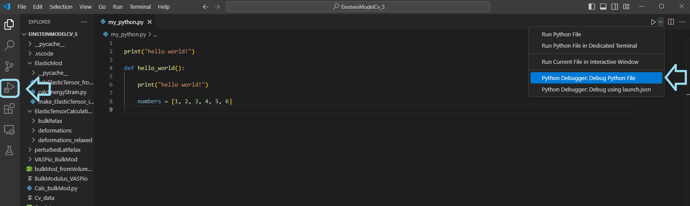
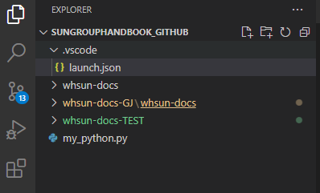
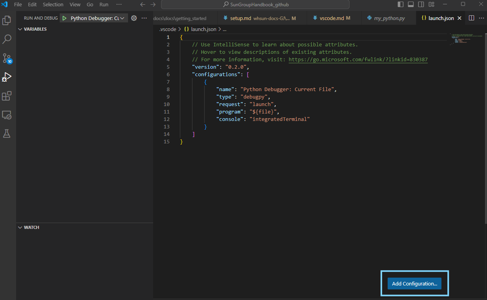
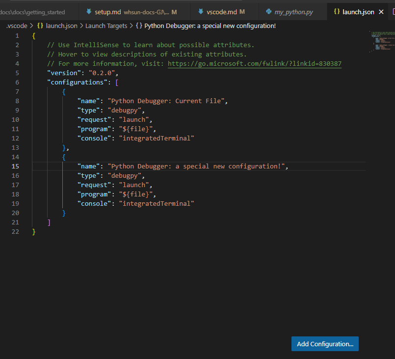
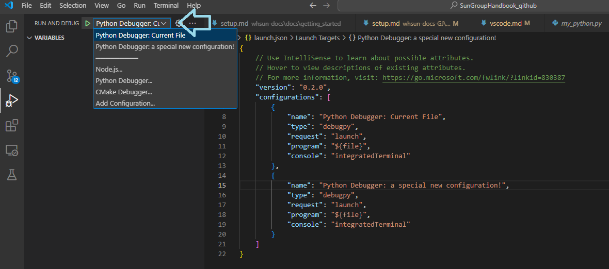
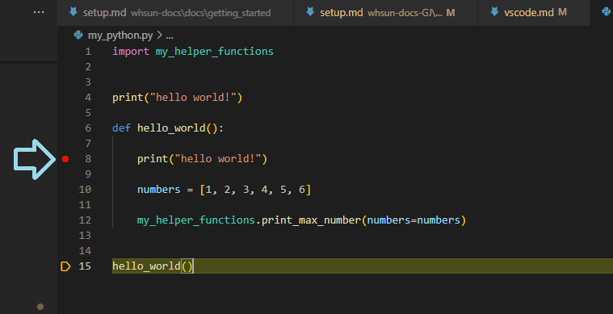

VS Code can be an extremely powerful IDE when you utilize its many features. Here's a list of features you may find useful in your programming endeavors! 

## Debug Tool
### Setting up the Python Debugger

While print statements can usually get you pretty far to debug your program, the VS code debugger can transform how you debug, and can help you learn about unfamiliar python objects with a convenient GUI. The Python Debugger Extension should already be installed when you install the Python extension, but you can verify this by searching for it in your extensions. To run your python file using the debugger, select the drop down menu next to the 'play' icon in the upper left-hand corner. Navigate to the dropdown item **Python Debugger: Debug Python File**. You can also select the 'run and debug' icon in the taskbar to the left, or, as a shortcut, you can press <kbd>F5</kbd>

<figure markdown="span">
  
  <figcaption>Running the VScode debugger.</figcaption>
</figure>

if it is your first time running the debugger, you will need to configure the debugger using a launch.json file. VS Code can run *many* programming languages, and each language requires its own debugger program - debug configurations let you tell VScode what type of debug program you are running, and lets you customize debug features. When you run the debugger for the first time, you should get a popup in the left side of the screen to select a debug configuration. To create a new debugger configuration, click **create a launch.json file**

<figure markdown="span">
  
  <figcaption> configure the debugger: create a launch.json file .</figcaption>
</figure>

You will then be prompted to select a debugging program. For each coding language, there is typically a unique debugging extension. Since you should already have the Python Debugger Extension, you should see a **Python Debugger** option in the dropdown menu. 

<figure markdown="span">
  
  <figcaption> Choose the python debugger as your debug program .</figcaption>
</figure>

Once you select the Python Debugger, you will then be prompted to choose a Debug Configuration. Select **Python File**, which creates a launch.json configured to debug the python file you are currently editing. 

<figure markdown="span">
  
  <figcaption> Choose "Python File" for the debug configuration .</figcaption>
</figure>

VS Code will then automatically generate a `./vscode` directory in your current working directory, and place the `launch.json` file there. It should also automatically open this file when you create it. 

<figure markdown="span">
  
  <figcaption> launch.json location: automatically saved to ./.vscode .</figcaption>
</figure>

Your launch.json will contain all the default options for the python debugger configuration

<figure markdown="span">
  
  <figcaption> deafult launch.json text .</figcaption>
</figure>

#### Default parameters

* `name` specifies the name of the debug configuration
* `type` specifies the debug program/extension which will be run - `"debugpy"` is the name for the Python Debugger 
* `request` specified how the debugger will be run, `"launch"` tells VS code to start the debugger on the desired file. The other option is `"attach"`, which lets you start the debugger on a process which is already running. 
* `program` lets you customize which program is run upon starting the debugger. The default `"${file}"` means "run on the currently open file", but if you wanted to *always* run a specific program on a single configuration, you might change this to the file path of your python file. 
* `console` specifies where output from the debug program should be printed. `"integratedTerminal"` sends output to the VS Code Integrated Terminal. 

The default debugger configuration is very sufficient. However, there are some fun features that you may add if needed:
#### Additional useful parameters
* `subProcess`: this parameter defaults to false, but I absolutely recommend that you default it to true. setting `"subProcess": true` lets you do subprocess debugging. This means you can 'step into' functions that are called in your program, but written in a separate file, letting you debug between python files all at once. 
* `stopOnEntry`: this feature, when set to true, means that the debugger will 'break' on the first line of your code. Otherwise, it will only break on user-specified breakpoints (which is often preferable)
* `python`: setting this parameter lets you specify the python interpreter that your debugger will use. Most of the time, you will just want to run your debugger on the same interpreter as your program (i.e. don't specify this parameter), but if you wanted to test your code on different versions of a package (in different environments), this feature may be useful to you.
* `autoReload`: enabling this feature allows you to edit code after breakpoints while the debugger is running, and the code updates will automatically be reloaded into the currently-running file. Include the following as a parameter in launch.json to enable autoReload
    ``` launch.json
    "autoReload": {
        "enable": true
    }
    ```
You can learn about other customizable debug parameters [here](https://code.visualstudio.com/docs/python/debugging#_set-configuration-options)

### Adding multiple debugger configurations
you may want to have multiple debug configurations for different files, especially if you are working with multiple languages in the same directory. If this is the case, you can either manually add a configuration to your launch.json, or you may click **Add Configuration...** at the bottom right corner of the launch.json window. 

<figure markdown="span">
  
  <figcaption> add a new configuration to your launch.json .</figcaption>
</figure>

Follow the prompts to add another debug configuration of your choosing, and VS code should populate another configuration to your existing list:

<figure markdown="span">
  
  <figcaption> launch.json location: automatically saved to ./.vscode .</figcaption>
</figure>

You can easily select between debug configurations in the debug console, like so. Note that the name of each unique configuration shows up in the selection options

<figure markdown="span">
  
  <figcaption> launch.json location: automatically saved to ./.vscode .</figcaption>
</figure>

### Running the Python Debugger

To start debugging a program, you may set 'break points' at specific lines of your program, usually just before your encounter an error in your code. At breakpoints, the program will stop and you will have the option to step through the code line-by-line and analyze current variables on the fly. Set breakpoints by clicking to the right of the line number which you want the program to stop at. A red circle should show up, indicating that this line now has a breakpoint. 

<figure markdown="span">
  
  <figcaption> set breakpoints by clicking next to the desired line number.</figcaption>
</figure>

Now, when you run the python debugger, the program will 'break' at the breakpoint you selected, and a control panel will pop up in the upper right corner. The debug console should open automatically and display all active variables.

<figure markdown="span">
  
  <figcaption> debugger features: console shows all local/global variables and functions, control panel lets you move through code.</figcaption>
</figure>

<figure markdown="span">
  
  <figcaption> debug control panel.</figcaption>
</figure>

The debugger console, from left to right, has the following features:

* **continue**: continue running code until the next breakpoint
* **step over**: go to the next line in the code. If this line is a function call, simply move to the next line in the home program
* **step into**: If the line you are on is a function call, go to the next line "inside" that function. This feature is incredibly useful for debugging your helper functions
* **step out**: If you are inside a function, go back to the original function call 
* **restart**: restart the program/debug session
* **stop**: stop the debug session, stop the program. 

???+ tip "Tip - test individual snippets of code"

    If you want to run small sections of code instead of the whole program, you can do so by selecting the lines you want to run, and pressing <kbd>Shift</kbd> + <kbd>Enter</kbd>, or by right clicking and selecting **Run Selection/Line in Python Terminal**


##Programming on Remote Hosts (HPCs, remote desktop, etc.)

##AI Copilot 